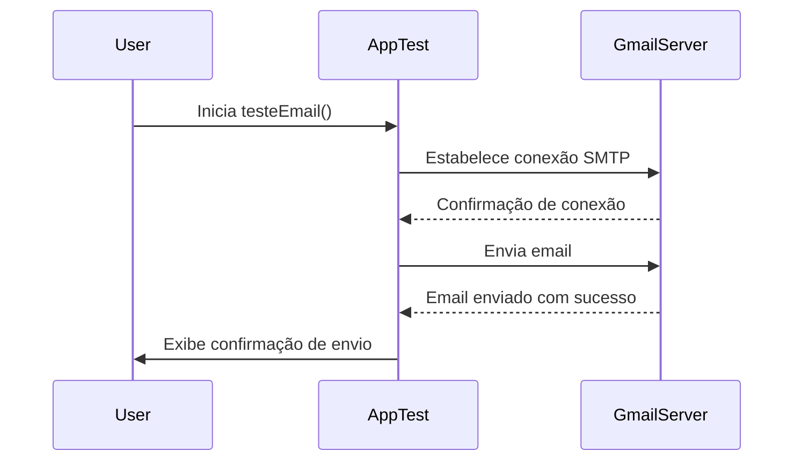

# Envio de Email com Java utilizando Gmail
Este projeto demonstra como enviar um email utilizando Java e a API JavaMail com o servidor SMTP do Gmail.

# Como Usar

## Configuração das Credenciais do Gmail:

Substitua seu-email e sua senha de aplicativo gmail nas variáveis userName e password na classe AppTest pelo seu email e senha de aplicativo Gmail, respectivamente.
Para gerar uma senha de aplicativo, visite a página de segurança do Google e siga as instruções para "Senha de app".

## Configuração do Ambiente:

Certifique-se de ter o JDK (Java Development Kit) instalado.
Este projeto pode ser gerenciado com Maven se preferir.
Execução
Compile e execute a classe AppTest.java para enviar um email de teste.

## Licença
Este projeto é licenciado sob a MIT License.

### Diagrama de Sequência

## Descrição do Diagrama
Este diagrama mostra o fluxo de comunicação entre o usuário, a aplicação AppTest e o servidor SMTP do Gmail durante o processo de envio de email.

## Notas
Para mais detalhes sobre a API JavaMail, consulte a documentação oficial da JavaMail API.
